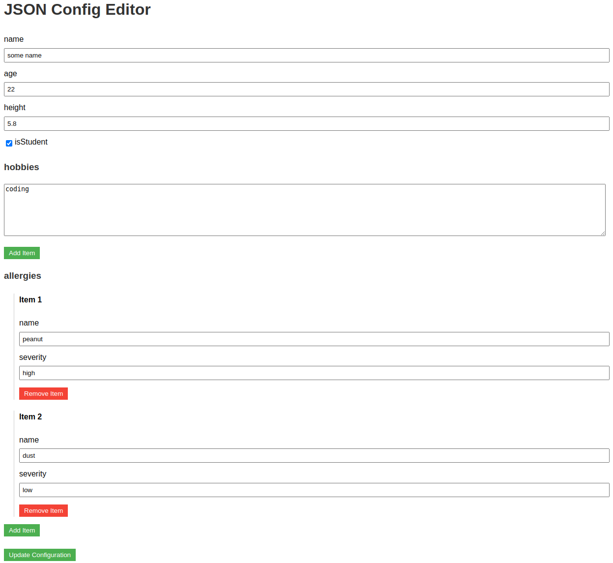

# JSON Config Editor

A web-based JSON configuration editor with authentication.




## Usage

```python
from json_ui import create_app

if __name__ == '__main__':
    app = create_app(
        config_path='/path/to/your/config.json',
        username='admin',
        password='your_secure_password'
    )
    app.run(host='0.0.0.0', port=5000)
```

## Features

- Edit any JSON configuration file through a web interface
- Supports nested objects, arrays, and various data types
- Basic authentication for security
- Easy integration into existing Flask applications

## Example

The screenshot above shows an example of editing a complex JSON configuration file. You can see how the editor handles nested objects, arrays, and different data types.

## Contributing

We welcome contributions! Please see our [Contributing Guide](CONTRIBUTING.md) for more details.

## License

This project is licensed under the MIT License - see the [LICENSE](LICENSE) file for details.


## Features

- Edit any JSON file through a web interface
- Supports nested objects, arrays, and various data types
- Basic authentication for security
- Easy integration into existing Flask applications